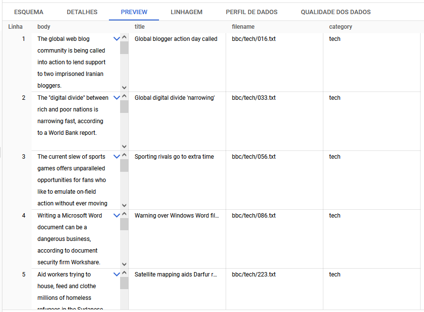
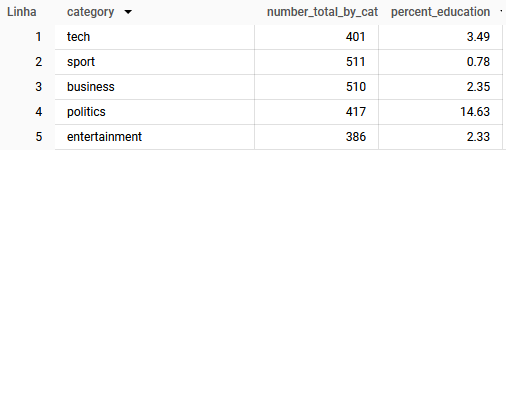

:dart: **Objetivo:** Identificar a porcentagem de notícias que possui o termo ***education*** no corpo da matéria.    

🎲 **Dados utilizados:** dados públicos disponíveis no BigQuery
* Quantidade de dados na tabela: 
   * 2225 linhas;
   * 04 colunas: body, title, filename, category. 
> **NOTA:** Fiz uma breve pesquisa e aparentemente esta tabela contém dados referentes ao ano de 2005.
 
:mag: **Prévia da tabela no BigQuery:**  
  

:computer: **Consulta SQL:**
```SQL
SELECT 
  category,
  COUNT(*) AS number_total_by_category,  
  CASE 
    WHEN category = 'tech' THEN 
          ROUND((SELECT count(*)
                FROM `bigquery-public-data.bbc_news.fulltext`
                WHERE (body LIKE '%education%' OR body LIKE '%Education%') AND category = 'tech') * 100 /
                (SELECT count(*)
                FROM `bigquery-public-data.bbc_news.fulltext`
                WHERE category = 'tech'), 2)
    WHEN category = 'sport' THEN 
          ROUND((SELECT count(*)
                FROM `bigquery-public-data.bbc_news.fulltext`
                WHERE (body LIKE '%education%' OR body LIKE '%Education%') AND category = 'sport') * 100 /
                (SELECT count(*)
                FROM `bigquery-public-data.bbc_news.fulltext`
                WHERE category = 'sport'), 2)
    WHEN category = 'business' THEN 
          ROUND((SELECT count(*)
                FROM `bigquery-public-data.bbc_news.fulltext`
                WHERE (body LIKE '%education%' OR body LIKE '%Education%') AND category = 'business') * 100 /
                (SELECT count(*)
                FROM `bigquery-public-data.bbc_news.fulltext`
                WHERE category = 'business'), 2)
    WHEN category = 'politics' THEN 
          ROUND((SELECT count(*)
                FROM `bigquery-public-data.bbc_news.fulltext`
                WHERE (body LIKE '%education%' OR body LIKE '%Education%') AND category = 'politics') * 100 /
                (SELECT count(*)
                FROM `bigquery-public-data.bbc_news.fulltext`
                WHERE category = 'politics'), 2)
    WHEN category = 'entertainment' THEN 
          ROUND((SELECT count(*)
                FROM `bigquery-public-data.bbc_news.fulltext`
                WHERE (body LIKE '%education%' OR body LIKE '%Education%') AND category = 'entertainment') * 100 /
                (SELECT count(*)
                FROM `bigquery-public-data.bbc_news.fulltext`
                WHERE category = 'entertainment'), 2) 
  END AS percent_education
FROM `bigquery-public-data.bbc_news.fulltext`
GROUP BY
  category;
```

:mag: **Resultado da Consulta no BigQuery:**  
  
